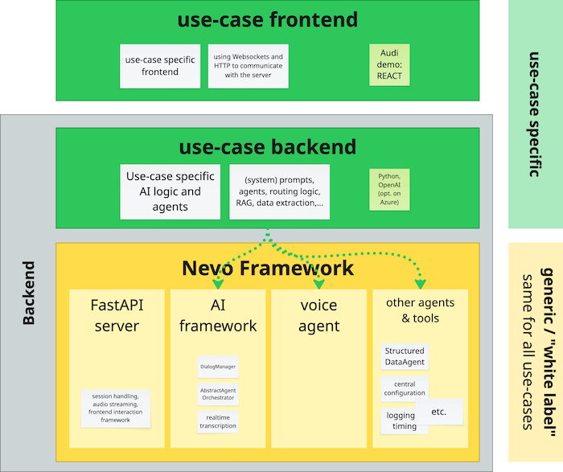
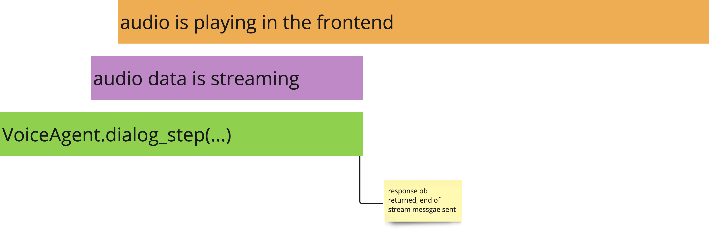

# The Nevo Framework


This repo contains the Nevo backend framework. It is a framework for building voice-driven multi-agent AI applications with a web-based frontend, where voice interaction and traditional "web" interaction (e.g. clicking things, sending forms) are combined.

The backend framework is used to build the backend servers for use-case specific applications. The framework provides a FastAPI-based backend server, handles authentication and user sessions, and provides endpoints for the frontend to interact with the AI. It also provides core components for the AI interaction as well as base classes and utilities for building AI agents, such as:

* A voice agent which handles audio streaming via the server.
* A structured data extraction agent.
* A dialog manager to track the dialog between the AI and the user.
* Protocols and simple mechanisms for the interaction between the AI and the frontend.
* Etc.

When building a Nevo application, you implement a use-case specific backend server that integrates the framework as a Python dependency. The use-case backend server implements the actual AI logic for your use-case, such as system prompts, parameters like model or temperature, RAG, the interplay between different AI agents if an agentive approach is used, etc. The frontend is a separate (web) application that uses the AI via the backend server provided by the framework.

In the following sections, we will walk through the process of setting up a use-case backend server in detail.
 

## Repo structure

This repo can be split into several functional parts. 

- `src.nevo_framework.llm` contains the AI logic, built around OpenAI. We are purposefully not using an abstraction layer like llamindes or langchain anymore, as we build on direct low level access to OpenAI functionality. 

- `src.nevo_framework.api` implements the FastAPI server and the AI logic for the voice-based chatbot.

- `src.nevo_framework.testing` contains headless tests and test utilities for the backend server.

- `analysis` contains scripts for analysing the AI's performance, comparing and benchmarking models, etc.

- `buildingblocks` contains components that are not part of the framework and not maintained to the same level of quality and reusability, but might still be useful as starting points for use-case specific implementations. This includes, for example, a Salesforce connection and a very simple in-memory vector store.

## Content

* [The Nevo Framework](#the-nevo-framework)
    * [Understanding the frontend](#understanding-the-frontend)
    * [Understanding the backend](#understanding-the-backend)
* [How to install and use it](#how-to-install-and-use-it)
* [Random & potentially deprecated stuff](#random--potentially-deprecated-stuff)


----

# The Nevo Framework 

_This is a starting point for a documentation. It will likely go elsewhere in the future, but for now it's here in the README._

The Nevo framework allows you to build voice-driven multi-agent AI applications with a web-based frontend, where voice interaction and traditional "web" interaction (e.g. clicking things, sending forms) are combined.

In order to build a Nevo-based application, you need to build two things:

* A use-case specific **backend**, which integrates the framework as a dependency. 
   * How to set this up technically was addressed above. 
   * The use-case backend focuses on the use-case specific AI logic, such as system prompts, parameters like model or temperature, RAG, the interplay between different AI agents if an agentive approach is used, etc. 
   * Technical infrastructure such as authentication, user sessions, and the interaction with the voice streaming AI is handled by the framework.

* A use-case specific **frontend**, which interacts with the backend and provides the user interface.
   * This can be a web application, mobile application, or any other type of client that can communicate with the backend.
   * The frontend is responsible for capturing user input (voice, text, clicks, forms, etc.), sending it to the backend, and displaying / playing back the AI's responses.
   * We do at the moment not provide a frontend framework, but we have two exemplary REACT components for voice-based and text-based communication of a frontend with the Nevo backend.



In more detail, the **framework** takes care of the following:

* Providing a FastAPI-based backend server.
    * Handling of authentication and managing multiple parallel user sessions.
    * Providing endpoints for the frontend to interact with the AI.
* Scaffolding for the AI (currently based on OpenAI) in a way that makes it easy to implent different applications. 
    * Managing the dialog between the AI and the user in an OpenAI compatible format.
    * Transcribing incoming user speech to text, so the application can process it without handling audio data.
    * Providing a generic "streaming audio chatbot" class that takes care of the interplay with the OpenAI API and technical details like streaming audio through the server to the frontend, handling tool calls, etc.
* "Non voice" interaction mechanisms between frontend and backend.
    * A protocol for sending commands to the frontend to trigger actions such as showing images from the AI logic.
    * A protocol for receiving and handling non-voice inputs from the frontend in the AI logic.
    * The framework provides the protocols and the basic mechanisms. What is actually being sent, received and triggered is up to the application.

In order to understand how to use the framework and how to build a frontend application, it is necessary to understand how the frontend application interacts with the server. We address this in the following section. After that, we look at how the framework is used to implement a use-case backend.

## Understanding the frontend

In this section, we walk through the interaction between the frontend and the backend step by step, from the frontend's perspective. 

The frontend first creates a session using the `/login` endpoint. This endpoint returns a session token and a session ID which must be sent with every subsequent request to the backend using cookies. The session ID is also used in the URL of the WebSocket connection.

* TODO: adress cookies, tokens etc in more detail

After the session is created, the frontend **must** connect to the websocket endpoint `/ws/{session_id}/{modality}`, where `{session_id}` is the session ID returned by the `/login` endpoint, and `{modality}` is either `text` or `audio`, depending on whether the frontend wants to use for text-based or voice-based interaction for the session. After connecting, the frontend must listen for data. All data sent to the frontend will go over this websocket connection. The frontend, however, will never send data over the websocket connection. It uses endpoints documented below to send data to the backend. 

### Voice-based interaction

In this section, we describe the interaction between the frontend and the backend for voice-based interaction. Text-based interaction will be covered in the next section.

The next step depends on whether the application is configured such that the AI speaks first or the user speaks first. We cover the "user speaks first" case first, and address the "AI speaks first" case afterwards.

In "user speaks first" mode, the frontend will allow the user to speak, and records the audio in [TODO] format. The audio file is uploaded to the backend using the `/receive_audio_blob` endpoint. This triggers what we call a "conversation step" in the backend. 

> [!IMPORTANT] 
> After an upload, the backend will not accept new audio data uploads until the current conversation step is finished! (**TODO**: Actually enforce this on the server.)

The backend processes the input and responds with an audio message from the AI by sending data over the websocket connection. The backend  will  only ever send two types of data over the websocket connection: 

* Binary audio data in [TODO] format. All binary data sent is audio data.

* Non-audio messages in JSON format. All messages are guaranteed to contain a string-valued `type` field that indicates the type of message. The frontend must handle these messages according to the type.

When the frontend starts receiving auio data, it is expected to it play back immediately, sequentially, without gaps and in the order of arrival. The Audi sample application uses the Web Audio API to play back the audio data, but the application may use any other suitable technology.

After the backend has sent all audio chunks of the current response, it sends the following end-of-dialog-step message:

        {"type": "END_OF_DIALOG_STEP"}

This indicates that no further data will be sent in the current conversation step. The backend allows the upload of new audio data, and the conversation loop can start again with a new upload.

The backend will also send end-of-response messages:

        {"type": "end_of_response"}

These indicate that the current response has ended, but additional responses might follow. This is the case, for example, when one agent says "Let me look this up for you..." (end-of-response sent here), while another performs a time-consuming RAG lookup and then responds with the actual answer. The frontend must not upload new audio data until the end-of-dialog-step message is received. 

> [!NOTE]
> Typically, audio chunks arrive without much delay between chunks, and the playback of the audio takes longer than receiving all the data. However, if OpenAI APIs are under a lot of load or if the network is slow, there might be gaps between audio chunks. The stream, however, only ends, and uploads are allowed again, when the backend sends the end-of-dialog-step message. The frontend must handle this correctly.

#### Text-based chat

In text chat mode, the backend will not stream audio data packages over the websocket, but text chunk messages, which are structured like this:

````json
{
    "type": "text_chunk",
    "content": "This "
}
````

Note that these are "chunks" and not complete responses. When the `content` is displayed in the frontend incrementally as it arrives, we get a ChatGPT style "streaming" display of the AI's response. Everything explained of end-of-dialog-step messages and end-of-response messages above applies to text chat as well.

Note that in text mode, end-of-response can be used to split multiple AI responses into multiple "speech bubbles" in the frontend.

In order to send user input in text mode, the frontend uses the frontend-to-backend communication protocol which is described further below in detail, using a specific message. Specifically, the frontend sends a POST request to the `/respond` server endpoint with the following JSON payload:

````json
{
    "type": "text_chat_response",
    "content": "What will be the weather like tomorrow?"
}
````

See below for more details on the frontend-to-backend communication protocol.

#### "AI speaks first" mode

In AI speaks first mode, the conversation loop is identical as described above, but the backend sends the first audio packages shortly after the frontend has connected to the websocket. The frontend must not upload audio data in this mode until the backend has sent the first end-of-dialog-step message.

### Web element messages: Backend to Frontend communication

In order to trigger actions in the frontend, the backend can send messages we call "web element messages". These messages are JSON objects that contain a string-valued `type` field indicating the type of message, and, optionally, additional data fields. Additional fields and the semantics of the message are defined by the application.

Web element messages are sent over the websocket connection, just like audio data and the end-of-dialog-step message. The frontend needs to handle these messages according to the type field.

Web element messages can be sent any time between the frontend triggering a conversation step and the end-of-dialog-step message. This means they can be sent before the AI speaks, in between audio data chunks, and after the AI has finished speaking (but before the end-of-dialog-step message). 

In AI speaks first mode, web element messages can be sent as part of the first conversation step after the frontend has connected to the websocket.

For example, a web element message that triggers the frontend to show an image might look like this on the server side:

````Python
class ShowImage(BaseModel):
    type: Literal["show_image"] = "show_image"
    image: str
    text: str | None = None
    layout_hint: Literal["large", "small"] | None = None
````

The resulting JSON message that arrives at the frontend might look like this:

````json
{
    "type": "show_image",
    "image": "audi_q6_interior.jpg",
    "text": "This is the interior of the Audi Q6.",
    "layout_hint": "large"
}
````

The framework does not define any web element messages – this is entirely up to the application. 

    ### Web element messages: Frontend to Backend communication

The frontend can also send web element messages to the backend. This can be used, for example, to trigger actions when a user clicks something, or to send form data when voice interactions does not make sense (nobody wants to voice-spell an email address).

These messages are also JSON objects, and they are also required to contain a string-valued `type` field that indicates the type of message. Additional fields are optional and depend on the type of message. Again, defining these messages and their semantics is up to the application.

The frontend sends these messages with HTTP POST using the `/respond` endpoint. The message is sent as JSON in the request body. Sending a message triggers a conversation step in the backend, just like uploading audio data. This means that the backend processes the message, might stream an audio response or send web element messages, and ultimately ends the step by sending the-end-of-dialog-step message.

The backend will put the message on its internal processing queue alongside the uploaded user audio. Messages and audio are processed in the order of arrival. The framework hands the messages unaltered to the application logic, and the application must handle them according to the type field.

Here is an example of a message where a user provides their contact information and consent to be contacted using a form. The message is defined in Python using pydantic as follows:

````Python
class ContactAndConsentResponse(BaseModel):
    type: Literal["contact_and_consent_response"] = "contact_and_consent_response"
    phone_number: str | None
    email: str | None
    contact_consent: bool
````

The corresponding JSON message that the frontend sends to the backend might look like this:

````json
{
    "type": "contact_and_consent_response",
    "phone_number": "123-123456789",
    "email": "john@doe.com",
    "contact_consent": true
}
````

Again, none of these message is provided or defined by the framework. The framework provides the protocol and the basic mechanisms, but the application is free to define its own messages and their semantics.

## Understanding the backend

As we now understand the basic interaction between the frontend and the backend from the frontend's perspective, we can now look at the backend in more detail. In the backend we distinguish between the **framework** and the **application**. As described above, the framework provides the server and basic _mechanisms_ the interaction, abstracting a lot of technical details like session handling or dealing with streaming data from the AI APIs. The application implements the actual use-case specific AI logic and interactions.

To build a use-case specific application, the developer must understand two components of the framework, and their interaction:

* The voice agent, implemented in the `VoiceAgent` class.
* The agent orchestrator.

### The voice agent

The `VoiceAgent` class encapsulates the interaction with the OpenAI API for all AI calls that generate audio. It handles audio streaming and makes sure the audio is routed by the framework through the websocket and to the (correct) client. It also handles other data streamed by OpenAI such as the transcription of the AI generated speech, or tool calls.

> [!IMPORTANT]
> **All** voice-generating AI calls **must** be performed using the `VoiceAgent` class. The application can subclass `VoiceAgent` to add use-case specific functionality, but the basic interaction with the OpenAI API must be done through the `VoiceAgent` and its `dialog_step` method.

Complex applications will typically use other AI call alongside the voice generating ones, for example to extract structured information from user input or model output, to summarize parts of a dialog for a RAG lookup, or to select an agent or a RAG source based on the user's request. These calls are not handled by the `VoiceAgent`, and the application is free to chose how to implement them. The framework provides a few helper classes for common cases such as structured data extraction, but – in contrast to using `VoiceAgent` for voice calls – the application is free to implement these calls in any way it sees fit.

So, how and where do we create a `VoiceAgent` instance, and how do we use it? This is where the agent orchestrator comes in.

### The agent orchestrator

The agent orchestrator is called by the framework whenever an AI response is required. This can be the case, for example, when a voice message by the user was received, but also when the application starts in "AI speaks first" mode, or when a web element message arrives from the frontend.

In its simplest form, the agent orchestrator creates a single `VoiceAgent` instance and calls it when called by the framework. In more complex applications, the agent orchestrator is responsible for things like:

* performing RAG lookups
* structured data extraction
* routing, i.e. dynamically selecting agents or RAG sources based on the user's request 
* dynamically setting or manipulating system prompts or parameters
* handling non-voice interactions between frontend and backend, for example sending web element messages to the frontend based on the AI's response

To understand the agent orchestrator and its interaction with the `VoiceAgent`, we first look at the simplest case.


````Python
CONFIG = get_master_config()


class MyOrchestrator(AbstractAgentOrchestrator): # ①

    def __init__(self, output_queue: asyncio.Queue, chat_modality: Literal["text", "audio"]): # ②
        super().__init__(output_queue, chat_modality) # ②

        system_prompt = """You are a helpful voice assistant. 
        You use short sentences and you avoid numbered lists and bullet lists.
        You formulate answers like a human would speak.
        """
        self.speaking_agent = VoiceAgent( 
            name="My nice assistant",
            default_system_message=system_prompt,
            async_openai_client=CONFIG.language_model_config.client["audio"],
        ) # ③

        async def dialog_step( self, 
            dialog: list[dict[str, str]], 
            web_element_message: dict[str, Any] | None,
        ) -> VoiceAgentResponse: # ④
            response = await self.speaking_agent.chat_step(dialog) # ⑤
            return response

````

① :  An agent orchestrator is a class derived from the abstract `AbstractAgentOrchestrator` class provided by the framework.

② :  The orchestrator's constructor must accept an `output_queue` and the `chat_modality` literal. The super constructor **must** be called with these arguments before any other code is executed (strictly speaking, before any `VoiceAgent` is created). The output queue is used by the framework to receive the messages messages to be sent to the frontend, and the `chat_modality` indicates whether the orchestrator is used for text or audio chat.

③ :  The orchestrator creates a `VoiceAgent` instance in its constructor and assigns it to `self.speaking_agent`, which is a property of the `AbstractAgentOrchestrator`. The agent is given a name, which helps in a multi-agent setup, and a default system prompt. `VoiceAgent`also accepts ad-hoc system prompts for each call, but the default system prompt is used if none is provided.

> [!IMPORTANT]
> The voice agent that is supposed to speak **must always** be assigned to the `speaking_agent` property of the orchestrator **before** the agent's `dialog_step` method is called (step ⑤). This ensures that the framework correctly connects to the audio output queue of the correct agent. Also, it helps to keep track of the agent in charge in a multi-agent system.

④ :  The orchestrator **must** implement the asynchronous `dialog_step` method with the signature shown. The method is called by the framework whenever an AI response is required. The `dialog` parameter contains the dialog so far - more details on the dialog below. We address the `web_element_message` parameter later. 

⑤ :  The orchestrator calls the `dialog_step` method of the `VoiceAgent` instance, with the `dialog` as parameter. This makes sure the voice knows the past dialog and can generate a context-appropriate response. This method is asynchronous and returns a `VoiceAgentResponse` object which the orchestrator must return to the framework. In this call, the orchestrator could use an ad-hoc system prompt which would override the default system prompt.

Note that `dialog_step` **does not and must not update or manipulate the `dialog`**! This is handled by the framework, and the dialog must be treated as **read-only** by the orchestrator.

### The `dialog` parameter

The `dialog` parameter is a list of dictionaries, each representing a turn in the dialog. This is the format expected by OpenAI's API. Each element contains at least two keys:

* `role`: The role of the speaker. This is either `"assistant"` or `"user"`.
* `content`: The transcribed (!) speech of either the assistant or the user. The framework will take care of transcribing the user's speech before calling the orchestrator. The transcription of the AI's speech is provided by the OpenAI API alongside the audio data. The `VoiceAgent` instance will take care of adding the AI's speech to the dialog.
* Additionally, assistant role elements contain and `"audio"` field. This is required by OpenAI to to keep track of the dialog and managed by the `VoiceAgent` instance. The application does not need to worry about this field.

The user's last message can typically (!) be accessed as `dialog[-1]["content"]` and the assistant's last message as `dialog[-2]["content"]`. However, in some cases the AI sends two or messages in a row, for example when switchin between agents or dialog phases.

> [!CAUTION]
> The agent orchestrator and other parts of the applications may read and anaylse the dialog, for example to perform RAG lookups or routing. However, **the dialog must not be modified** in any way (but see below).

A few things to note about the `dialog`:

* The dialog will **never** contain system prompts.

* The dialog is not guaranteed to contain assistant and user messages in turn. In multi-agent setups, there can be several assistant messages in a row, for example when one agent hands over to another. Check the `role` field to determine who generated the message in a complex setup.

* There is no guarantee which role created the first message - this depends on whether the application is configured to start with the AI speaking or the user speaking.

* Did we mention that you should not modify the dialog? You should not modify the dialog.

#### But how can we do RAG (and other prompt manipulation) without modifying the dialog?

We are used to implementing RAG and other patterns by changing the users input to an AI model. Let's say the user asked:

> What was the revenue in Q4?

In a classic RAG setup, we would change this to something like:
>
>Answer the user's QUESTION using only information provided under SOURCES and no prior knowledge.
>
> QUESTION: What was the revenue in Q4?
>
>SOURCES: 
>
>{RAG sources here}


How can we do this if we cannot manipulate the dialog? With a dynamic system prompt, where we put the RAG instructions:

>You are a helpful voice assistant. {other system prompt stuff}
>
>If the user asks a question, answer it using only information provided under SOURCES and no prior knowledge.
>
>SOURCE: {RAG sources here}


Then we can leave the user input unchanged in the dialog, and the AI will still know what to do. While system prompts are often treated as static, there is no reason why they cannot be dynamic and change based on the dialog. The `chat_step(...)` methdod of the `VoiceAgent` class accepts an ad-hoc system prompt that will override the default system prompt for the current call.

#### But why can't the dialog be modified?

Strictly speaking, only the assistant parts of the dialog must not be modified. The reason for this is that OpenAI does not look at the `content` field of the assistant messages – this is only provided for the application's convenience. What OpenAI is using internally for context is presumably an audio token representation of what the AI said, which is referred to by the `audio` field. Hence, manipulating the `content` field for an assistant message would not have any effect on the AI's response.

However, we strongly advise against manipulating the `content` field of the user messages as well since the dialog keeps track of what was actually said by both AI and user.

### A more complex agent orchestrator

Here we look at a (still somewhat simplistic) mock example of what a multi-agent orchestrator might look like, and how it uses  `VoiceAgent` instances to handle the dialog.

```Python

class ComplexOrchestrator(AbstractAgentOrchestrator): 

    def __init__(self, output_queue: asyncio.Queue, chat_modality: Literal["text", "audio"]): 
        super().__init__(output_queue, chat_modality) 

        # setup agents and a router ①
        self.welcome_agent = VoiceAgent( 
            name="Welcome agent", default_system_message=...,
        )
        self.product_support_agent = VoiceAgent( 
            name="Product support", default_system_message=..., tools=[...],
        )
        self.appointment_booking_agent = VoiceAgent( 
            name="Appointment booking", default_system_message=..., tools=[...],
        )
        self.router = Router(...)

        # assign the first speaking agent ②
        self.speaking_agent = welcome_agent


    async def dialog_step( 
        self, dialog: list[dict[str, str]], web_element_message: dict[str, Any] | None
    ) -> VoiceAgentResponse: 

        if len(dialog) == 0: # ③
            assert self.speaking_agent == self.welcome_agent
            return self.speaking_agent.chat_step(dialog) 
        else:
            user_message = dialog[-1]["content"] 

        # evaluate the routing and pick a speaker ④
        routing = self.router.get_routing(user_message) 
        if routing == "product_support":
            self.speaking_agent = self.product_support_agent
        elif routing == "appointment_booking":
            self.speaking_agent = self.appointment_booking_agent
        else:
            self.speaking_agent = self.welcome_agent

        # call the speaking agent ⑤ and react to the response 
        response = await self.speaking_agent.chat_step(dialog) 
        if self.speaking_agent == self.product_agent and response.tool_call: 
            # handle tool call
            ...
        elif self.speaking_agent == self.appointment_booking_agent and response.tool_call:
            # handle tool call
            ...

        return response # ⑥
```


① : The orchestrator creates three `VoiceAgent` instances for three agents with different roles. The agents are given names and specific systemp prompts. The `product_support_agent` and the `appointment_booking_agent` are also given tools. The orchestrator also creates a `Router` which we can think of as a call to an LLM (without voice capabilities) that decides which agent to use based on the user's message (this is not part of the framework).

② : The orchestrator assigns the `welcome_agent` to the `speaking_agent` property. This is the agent that will speak first in the conversation. Note that the current speaking agent **must** be assigned to the `speaking_agent` property before the agent is called in step ⑤. 

③ : When an AI response is requested by the framework, we look whether the user has said something by checking the length of the dialog. If the dialog is empty, we know the AI should speak first. In this case, we call the `dialog_step` method of the current `speaking_agent` instance, which we assert to be the "welcome agent". If not, we get the user's last message.

④ : The orchestrator uses the router to determine which agent to use based on the user's last message. Depending on the routing, the orchestrator assigns the correct agent to the `speaking_agent` property. (A realisitc router would probably use a longer piece of the dialog and not just the user's last message.)

⑤ : The orchestrator calls the `dialog_step` method of the current `speaking_agent` instance, with the `dialog` as parameter. It then reacts to tool calls if necessary, checking `self.seaking_agent` to determine which agent is in charge.

⑥ : The orchestrator returns the response to the framework.

Note that in a real application, the different speaking agents would probably be subclasses of `VoiceAgent` with additional functionality. Their system propmpts and tool calls would be set up in their constructors (`__init__` methods). The `Router` would probably not decide in every step of the dialog which agent to use, but only when the user's message triggers a change in the conversation flow.


### Receiving non-voice messages from the frontend

The orchestrator's `dialog_step` method also receives a `web_element_message` parameter. This parameter is set when the client sends a web element message to the server, indicating that the user has performed some kind of action - other than speaking - that _might_ require a backend reaction. This might be a click or a form submission. How this mechanism is used is up to the application.

When `web_element_message` is set, there will be no new voice conversation step; i.e. `dialog` is in the same state as it was in the previous `dialog_step` call. 

The client sends their web element message as a JSON object. `dialog_step` receives it as a dictionary. `web_element_message` is guaranteed to contain a string-valued `type` field that indicates the type of message. It is recommended (but not required) that the server defines Pydantic classes for all messages such that the message can be safely deserialized into a Python object. 

Here is an example of how this might look like when Pydantic is used:

````Python
# Pydantic models for web element messages:

class FormResponse(BaseModel):
    type: Literal["form_response"] = "form_response"
    name: str
    email: str 
    phone: str | None

class Clickesponse(BaseModel):
    type: Literal["click_response"] = "click_response"
    clicked_image: str


# Message parsing:

try:
    if web_element_message["type"] == "form_response":  # "type" always exists
        response = FormResponse.model_validate(web_element_message)
    elif web_element_message["type"] == "click_response":
        response = ClickResponse.model_validate(web_element_message)
    else:
        raise ValueError("Unknown web element message type")
except ValidationError as e:
    # handle validation error
    
````

### Not reacting to the user

Sometimes, and especially when receiving a web element message as described above, we might not want to react with a voice response. However the framework requires the `dialog_step` method to return a `VoiceAgentResponse`. In this case, we can simply return an empty response:

````Python
return VoiceAgentResponse(agent_name="no agent")
````

`agent_name` can be set to whatever makes sense.


### Sending non-voice messages to the frontend

We cannot only receive messages from the frontend, but also send messages to the frontend, to trigger actions like displaying images or text matching the conversation, or switching the state of the UI.

On the server side, these messages are represented as Pydantic objects, which has a number of advantages over using raw dictionaries. They are required to have a string-valued `type` field that indicates the type of message, and they are required to be serializable to JSON. Besides these constraints, the structure and content of the messages is entirely up to the application. The framework will serialize Pydantic objects to JSON before sending.

There are several ways of sending those messages from the backend, catering to different requirements of timing them with the AI conversation.

The simplest way is to call the `send_web_element_message` method of the agent orchestrator. This will send the message immediately:

````Python
# inside the dialog_step(...) method of the orchestrator
self.send_web_element_message(ShowImageMessage(file="image.jpeg"))
````

#### Bundling messages with the AI response

Alternatively, messages can be bundled with the `VoiceAgentResponse` returned by the `dialog_step` method of the voice agent. For example:

````Python
# inside the dialog_step(...) method of the orchestrator
response = await self.speaking_agent.chat_step(...)
return response.with_web_element_message(
    ShowImageMessage(file="image.jpeg")
)
````

This can also be chained:

````Python
response = await self.speaking_agent.chat_step(...)
return response.with_web_element_message(
    ShowImageMessage(file="image.jpeg")
).with_web_element_message(
    ShowCaptionMessage(text="This is a pretty picture.")
)
````

Bundling with the response is useful when a message is generated in a class that does not have access to the agent orchestrator, for example a custom voice agent that is derived from `VoiceAgent`. Rather than passing around references to the agent orchestrator all over the code base, the message can be bundled with the response.

The framework will send the bundled messages immediately after the `dialog_step` method returns. 

> [!NOTE]
> Note that a voice agent will return its response only after _streaming_ all of the audio packages. This means that the frontend can only react to the message when the AI is already speaking. However, streaming audio is typically much faster than _playback_ (unless the network connection is terrible), so the frontend will typically react significantly before the AI stops speaking, at least when it speaks a bit longer.



That the `VoiceAgentResponse` is returned after streaming finishes also means that we already know what the AI is saying when when we get the response object from `dialog_step(...)`. The AI response can be accessed in the `dialog`, but, for convenience, it is also accessible as `VoiceAgentResponse.text`. This allows us to create a message based on what the AI has just been saying. In the following example, we use this to send a an AI generated summary of the AI's response to the frontend, while the AI is speaking:

````Python
response = await self.speaking_agent.chat_step(...)
summary = await create_summary(response.text)
return response.with_web_element_message(
    ShowSummaryMessage(text=summary)
)
````
`create_summary` would be implemented with a simple on-off LLM call.

#### Timed messages

Consider the following examples:

````Python
# inside the dialog_step(...) method of the orchestrator
self.send_web_element_message(ShowImageMessage(file="image.jpeg"))
response = await self.speaking_agent.chat_step(...)
return response
````

````Python
# inside the dialog_step(...) method of the orchestrator
response = await self.speaking_agent.chat_step(...)
return response.with_web_element_message(ShowImageMessage(file="image.jpeg"))
````

The first example sends the message clearly before the AI starts speaking. The second example sends the message after streaming ended, which is likely before the end of playback, but for a long AI answer this might still be a significant time after the AI started speaking.

Sometimes you want to send a message _after_ the AI starts speaking (because it is related to what it is saying), but still significantly earlier than it would arrive with the bundling approach. In this case, we can use a third approach:

````Python
# inside the dialog_step(...) method of the orchestrator
response = await self.speaking_agent.chat_step(
    dialog,
    timed_web_element_messages=[
        TimedWebElementMessage(
            time_delta=2.0,
            message=ShowImageMessage(file="image.jpeg")
        )
    ]
)
````

Here, we pass our message (or messages) to the `dialog_step` method of the voice agent, wrapping it in a `TimedWebElementMessage` object. The `time_delta` field is the time in seconds _after the AI starts streaming_ when the message should be sent. Here, the voice agent will take care of sending the messages, which will be slipped in between the audio chunks. 

Note that the message will be sent the latest after the last audio chunk of the AI response, which is the same timing that would be achieved with response bundling.


> [!NOTE]
> The timing is not 100% accurate as the framework will only send the message between two audio chunks.
>
> With this mechanism, and in constrast to response bundling, the AI response is not known when the message is sent. This means that the message cannot be based on the AI response. 

-------------------


# How to install and use it

We recommend using `pipenv` to manage the dependencies, and we assume you have installed it on your system. If you have not done so, please refer to the [pipenv documentation](https://pipenv.pypa.io/en/latest/) for installation instructions.

> [!WARNING]
> Nevo requires at least Python 3.11. Most of the framework is tested to work with Python 3.13, but the Salesforce connection in `buildingblocks` is not yet compatible with Python 3.13 due to an issue in the Salesforce library we use. If you don't need Salesforce connectivity, or you implement it yourself in the use-case framework, you can use Python 3.13.

We recommend to use a parallel folder structure like this for all Nevo development:

```
[...]/nevo/nevo_framework

[...]/nevo/my_use_case_backend
[...]/nevo/my_use_case_frontend

[...]/nevo/my_other_use_case_backend
[...]/nevo/my_other_use_case_frontend
```

To set up a Nevo backend for your use-case, create a dedicated repository for the use-case backend, called the **use-case project** in the following. In the `nevo` folder, you then clone the frontend and backend repositories, e.g. `my_use_case_backend` and `my_use_case_frontend`, as well as the framework repository.

Then install the framework into the use-case project with `pipenv`, adjustoing the Python version as you see fit (see the note above):

```bash
cd my_use_case_backend
pipenv install -e ../nevo_framework --python 3.13
```

> [!NOTE]
> If you are testing a specific development branch of the framework, make sure to check out that branch in the framework repository before running the `pipenv install` command. This will ensure that the use-case project uses the correct version of the framework. When you switch branch, you will probably have to re-install.

> [!WARNING]
> The `-e` flag installs the framework in "editable" mode, meaning that changes to the framework code will be reflected in the use-case project without having to reinstall the package. This is only recommended while the framework is under development. As it matures, the framework will be released as a package, and the use-case projects will depend on a specific version of the framework.

Next, install other dependencies your use-case project needs with pipenv.

Then, proceed to configure the use-case project (e.g. `my_use_case_backend`) as follows:

* Create a `my_use_case_backend/src` directory for your source code.

* Create an `.env` file in the `my_use_case_backend` directory, as documented below, and don't forget to git-ignore it.

* Create a `my_use_case_backend/config` directory.

* Copy the config templates `nevo_framework/config/log-server.ini` and `nevo_framework/config/master_config.json` from the framework repository to the use-case project `config` dir.

    * `master_config.json` is used to configure the framework for your use-case project. You will need to change some settings there.
    * `log-server.ini` is used to configure the logging of the backend server. This probably does not need to be changed for the use-case project, but it can be adapted if needed.

* Create a `my_use_case_backend/src/main.py` file in the use-case project as shown below (an example is also included in the framework repository in `buildingblocks`). This file is the entry point for the backend server.

```python
from dotenv import load_dotenv

load_dotenv()  # the order is important here: load_dotenv MUST be called before framework import

from nevo_framework.api import api as framework_api

if __name__ == "__main__":
    framework_api.main()
```

With this main file, the server can be started in `my_use_case_backend` as follows:

```bash
pipenv shell
python src/main.py --reload
```
Additional command line arguments are documented below.

At this point you can try to start the backend server as shown above. If everything is set up correctly, you should see the FastAPI server starting up and listening on `http://localhost:8080`. However, in the default configuration, the framework will only use a default agent orchestrator shipping with the framework, implementing a simple voice assistant.

To create your own AI logic, you need to implement an agent orchestrator, and tell the framework to use it.

> [!NOTE]
> The concepts and ideas behind the agent orchestrator are documented in detail in sections above. In this section we focus purely on the technical setup

In your use-case project, create a module for your orchestrator, e.g. `src/orchestrator.py`. In this module, create a class that subclasses the abstract `AbstractAgentOrchestrator` class provided by the framework. This class is the entry point for the AI logic and is called by the framework whenever an AI response is required. 

Here is a minimal example - note that the details are explained in sections above.

````Python
import asyncio
from typing import Any

from nevo_framework.config.master_config import get_master_config
from nevo_framework.llm.agent_orchestrator import AbstractAgentOrchestrator
from nevo_framework.llm.agents import VoiceAgent, VoiceAgentResponse

CONFIG = get_master_config()


class MyFrenchOrchestrator(AbstractAgentOrchestrator): 

    def __init__(self, output_queue: asyncio.Queue, chat_modality: Literal["text", "audio"]):
        super().__init__(output_queue, chat_modality)

        system_prompt = """You are a helpful voice assistant. 
        You formulate answers like a human would speak.
        You use short sentences and you avoid numbered lists and bullet lists.
        You only speak French, regardless of the user's language.
        """
        self.speaking_agent = VoiceAgent( 
            name="My French assistant",
            default_system_message=system_prompt,
            async_openai_client=CONFIG.language_model_config.client["audio"],
        ) 

        async def dialog_step( self, 
            dialog: list[dict[str, str]], 
            web_element_message: dict[str, Any] | None,
        ) -> VoiceAgentResponse: 
            response = await self.speaking_agent.chat_step(dialog) 
            return response
````

Finally, you need to tell the framework to use your orchestrator instead of a default one. To do this, open the `config/master_config.json` file in your use-case project and edit the following line to refer to your orchestrator class:

```json
    "agent_orchestrator": "orchestrator.MyFrenchOrchestrator"
```

When you now launch your server, look out for the following line on the log:

````
INFO [api]: Orchestrator class orchestrator.MyFrenchOrchestrator validated successfully
````

This tells you that the framework was able to instiatiate your orchestrator, and that it is an instance of `AbstractAgentOrchestrator`.


### Setting up the .env file

>[!NOTE]
> This needs updating!

This is the required `.env` file for the use-case project. The file should be placed in the `my_use_case_backend` directory, and it is git-ignored.

```
# if used with OpenAI
OPENAI_API_KEY=... # if used with OpenAI

# if used with Azure
AZURE_OPENAI_API_KEY=... 
API_BASE=https://skodabot-llm-sweden.openai.azure.com

# document this 
JWT_SECRET_KEY=...
HASHED_PASSWORD=...
 
ENABLE_DOCS=true

API_PASSWORD=...
LOCAL_API_ENDPOINT=http://localhost:8080

# document this better 
SALESFORCE_SANDBOX_PASSWORD=...
SALESFORCE_SANDBOX_USERNAME=...
SALESFORCE_SANDBOX_TOKEN=...
```

### The master config

>[!NOTE]
> This needs to be written!


### Backend server command line arguments

>[!NOTE]
> This needs updating!

The backend server accepts the following command line arguments:

* `--reload`: Enables hot reloading. This is useful for development, but should not be used in production. Note that reloading sometimes hangs. Watch the terminal for this.

* `--log_chatsteps`: Writes a JSON file for each AI chat step in `src/api/temp`. with the transcription of what the AI says, the audio lenght and the tokens used.

* `--store_audio`: Stores all AI generated audio as WAV files in `src/api/temp`.

* `--ai_first`: AI speaks first. This means that the AI will start the dialog when the user connects to the backend. The AI will then wait for the user to speak before continuing the conversation. **This overrides the setting from the master config file. Only use it for debugging.**

* `--user_first`: User speaks first. This means that the user must speak before the AI can respond. If this flag is set, the AI will not generate an initial response.  **This overrides the setting from the master config file. Only use it for debugging.**

* `--debug <flags>`: Sets various debugging flags. `<flags>` can be a comma-separated list without whitespaces. The use-case projects can check these flags with the `has_debug_flag(flag)` in `MasterConfig`.

------
------

# Random & potentially deprecated stuff

## Azure Deployment of the Audi demo

We have set up GitHub Actions to deploy the updated backend container whenever you push to the `main` branch.

An additional seperate "dev" deployment is deployed when pushing to the `main-dev` branch.

**Don't deploy without permission from the project owners.**

### Azure links

* DEV, from branch `main-dev` 
    * [Deployed demo on Azure DEV](https://skodabot-react-frontend-dev-fgaxhfdsbcazevcw.francecentral-01.azurewebsites.net/)
    * [Azure frontend Web App Resource DEV](https://portal.azure.com/#@mydiconium.onmicrosoft.com/resource/subscriptions/5f2bdb04-498c-4086-ab35-f8a0e9b4e3d8/resourceGroups/RG-Berlin-RandD/providers/Microsoft.Web/sites/skodabot-react-frontend-dev)
    * [Azure backend Web App Resource DEV](https://portal.azure.com/#@mydiconium.onmicrosoft.com/resource/subscriptions/5f2bdb04-498c-4086-ab35-f8a0e9b4e3d8/resourceGroups/RG-Berlin-RandD/providers/Microsoft.Web/sites/skodabot-backend-dev)
* PROD, from branch `main`
    * [Deployed demo on Azure PROD](https://skodabot-react-frontend-d0g2c9cfesfmb7cc.francecentral-01.azurewebsites.net/)
    * [Azure frontend Web App Resource PROD](https://portal.azure.com/#@mydiconium.onmicrosoft.com/resource/subscriptions/5f2bdb04-498c-4086-ab35-f8a0e9b4e3d8/resourceGroups/RG-Berlin-RandD/providers/Microsoft.Web/sites/skodabot-react-frontend/appServices)
    * [Azure backend Web App Resource PROD](https://portal.azure.com/#@mydiconium.onmicrosoft.com/resource/subscriptions/5f2bdb04-498c-4086-ab35-f8a0e9b4e3d8/resourceGroups/RG-Berlin-RandD/providers/Microsoft.Web/sites/skodabot-backend-prod/appServices)


## Random developer notes

* Images are in the `public/...` folder in the frontend repo. Do **not** include `public` in the image path in the frontend code. Example: `public/audio/q6_interior.jpg` should be referenced as `audio/q6_interior.jpg` in messages to the frontend.


-------------------
-------------------